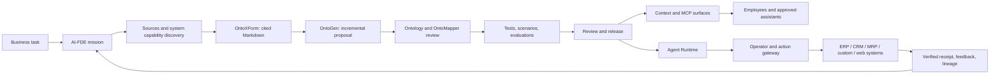

# Product principles and experience

## The second design decision

The [shared initial design](https://chatgpt.com/share/6ab6a918-827c-83ec-86c5-f022cdc6ea5e) evolved from a lighter ontology engineering workbench (v0.1) into a broad enterprise Ontology and Context platform (v0.2). It retained ten product areas: Pipeline Manager, Ontology Manager, Test Harness, Evaluation, Knowledge Base, OntoMapper, Releases, FDE Workbench, Context Studio/Service, and an MCP access hub. It also rejected generating a separate frontend/backend/runtime for each tenant.

The current brief makes one explicit change: **Onto Planet V2 owns a new Agent Runtime, Agent Harness, and Operator, designed with Ontology V2 from the start.** This supersedes the older recommendation to leave agent execution entirely in an external harness. The shared-implementation and definition-package principles still hold. A customer may bring an external agent, but Onto Planet must also run its own governed agents.

## Product promise

**Turn business knowledge and live enterprise systems into a trustworthy operational ontology, then make that ontology usable by employees and agents to understand, decide, and act.**

The product serves three work modes:

| Mode | User | Success |
|---|---|---|
| **Build** | FDE, implementation engineer, domain owner, developer | A business task becomes evidence-linked ontology, real bindings, context, tests, agent behavior, and a reviewed release. |
| **Use** | Employee, manager, internal agent, approved office assistant | They get the right answer and permitted next step without learning ontology terminology. |
| **Govern** | Security, data, and operations owners | They can see exactly what was exposed or changed, by whom or which agent, under which versions and approvals. |

## Non-negotiable design principles

1. **Start from the business task.** Ask what people must know, decide, or do. Derive the required objects, relationships, data, rules, actions, context, and tests. Type editors remain available, but are not the first-run experience.
2. **Make the ontology operational.** A definition includes data, logic, action, and security. Object search, linked traversal, saved object sets, functions, action previews, and source-backed timelines must work against actual instances, subject to policy.
3. **Keep one shared product.** Publish reviewed tenant/domain definition packages and load them in shared services. A new tenant, domain, or office client does not generate a product fork.
4. **Treat AI as an implementer with evidence, never as the authority.** OntoXForm and OntoGen produce provenance-linked Markdown and incremental semantic proposals. AI-FDE proposes mappings, tests, and fixes. Business owners confirm meaning; deterministic validators and policy gates decide activation and execution.
5. **Separate knowledge, semantics, and current fact.** Approved Markdown is the source for human-readable knowledge. Ontology definitions are executable semantic assets. ERP/CRM/MRP or explicitly native objects own current business facts. Search indexes and Context Packs are derived, not new truth stores.
6. **Make context task-specific and least-disclosing.** A versioned Context Profile selects semantic facts, approved knowledge, live objects, rules, available actions, and confirmed run history. The request-time Context Pack is authorized before retrieval, bounded, cited, timestamped, and honest about missing data.
7. **All business writes cross one deterministic boundary.** The model emits an ontology-typed intent. The action gateway validates schema, source/object revision, grants, business guards, approval, and binding. The operator executes and verifies. An unknown remote outcome is reconciled before retry.
8. **Agents are durable and inspectable.** The new runtime checkpoints runs, pins all dependency versions, enforces budgets and step limits, waits for humans when required, and records typed events/effects. Child agents get narrower capabilities, never inherited blanket access.
9. **Skills explain, plugins package, MCP connects.** A Skill is a reusable task procedure with tests and provenance, without inherent permission. A Plugin is a signed/versioned deployment bundle requesting explicit capabilities. MCP exposes scoped tools/resources and imports external tools through review; its tool metadata does not become policy.
10. **Quality is a release property.** Tests cover contracts, rules, mapping, security, and failure recovery. Evaluations compare task quality, safety, latency, and cost across versions. Required `fail`, `error`, or `unsupported` checks block release.
11. **Progressive capability is explicit.** A domain can be knowledge-ready, data-connected, or action-enabled. Each level has visible limitations. A feature is labeled `Designed`, `Implemented`, `Verified`, or `Production-ready`; no roadmap entry is called parity.
12. **Keep extension and deployment seams without premature service sprawl.** Package modules align with business ownership. Initial deployment can be a modular API/control service with isolated workers; split services when scaling, trust boundaries, or availability require it.

## Product domains

These are product capabilities, not a prescribed count of microservices.

| Domain | Responsibilities | Principal artifact |
|---|---|---|
| Missions & AI-FDE Workbench | Interview, domain discovery, source inspection, gap/conflict ledger, proposal, test, delivery | Business task and evidence-linked change proposal |
| Pipeline Manager | OntoXForm/OntoGen steps, reruns, cost and failure limits | Versioned pipeline run and proposal |
| Knowledge Base | Markdown, source spans, review, effective dates, impact | Approved knowledge revision |
| Ontology Manager & Object Service | Value/object/relation/shared/interface types, rules, functions, actions, events, policy, object queries and timeline | Ontology revision and governed object view |
| Connections & OntoMapper | Connections, identity, read/action/event bindings, freshness and capability discovery | Binding revision |
| Context Studio & Service | Context Profiles, Inspector, request-time Context Packs | Profile revision and cited Context Pack |
| Agent Studio & Runtime | Agent specs, harness, operator, approval, memory, run trace | Pinned agent run and action receipts |
| Skills, Plugins & MCP Hub | Task packs, extension lifecycle, Builder/Context/Consumer surfaces, compatibility lab | Published extension and scoped tool catalog |
| Test Harness & Evaluation | Deterministic contract tests, isolated scenarios, holdout evals, client tests | Versioned evidence and regression result |
| Releases & Governance | Unified diff, impact, security simulation, quality gates, activation/rollback, consumer version tracking | Immutable release and environment activation |

## North-star workflow

The first end-to-end scenario is a **procurement request**: an approved policy, `PurchaseRequest` ontology, sandbox ERP read/action binding, role-based explanation and approval preview, a governed execution receipt, and regression evidence. A later cross-system scenario is **late-order resolution** across CRM customer, ERP order, and MRP material availability. Neither demo policy nor sample threshold is a customer policy until a domain owner approves it.

## Experience direction

The interface should feel like an operations product: clear status, visible provenance, small reversible steps, and evidence near every decision. It should have three coherent entry points rather than exposing every subsystem equally to every user.

### Build

The home screen begins with **Missions**, not an empty graph. A mission shows the business question, success criteria, known systems, unresolved gaps, impacted assets, test state, and production version. AI-FDE is embedded in this work: it can propose a type or mapping, display the exact source span and semantic diff, run a sandbox test, and request review. It cannot silently overwrite human edits.

The Ontology view supports typed editors and **task-linked object investigation**: search, stepwise filters, relation traversal, saved object sets, aggregation, timeline, and registered function/action preview. A graph is an optional view for complex relationships. The [September 2026 Carbon Insight announcement](https://www.palantir.com/docs/foundry/announcements/2026-09) reinforces this direction while describing Insight as opt-in. A unified change proposal shows per-asset diffs, checks, and approvals. The Context Inspector shows exactly what a role and client would receive, why, from which revision, at what freshness, and with which omissions.

### Use

Employees enter through role-specific **task packs** such as “My approvals” or “Explain this order delay.” A task pack can expose a short Skill, allowed query and action tools, examples, result cards, help, and a connection path to an approved office client. A response presents sources, current object state, allowed next steps, and clear confirmation for material actions. It does not require employees to know `ObjectType`, `get_task_context`, or MCP configuration.

### Govern

The governance view joins the definition diff, lineage impact, permission simulation, test/eval evidence, approvals, release activation, consumer-loaded hashes, agent traces, and source-system receipts. It distinguishes **published**, **activated**, and **loaded by consumers**. Rolling back a definition does not undo a transaction already completed in an ERP.

## Client interoperability stance

MCP is a protocol, not a guarantee that every host supports the same authentication, UI, task, or Skills features. WorkBuddy, Claude Cowork, Codex/ChatGPT, Grok, Muse, and other office hosts are compatibility targets from the shared brief. Each is recorded in a Client Compatibility Lab with tested host/version, login, discovery, query, structured response, UI fallback, action preview, async task, revocation, and network reachability. Until a specific client passes those checks, it remains a target rather than a claimed integration. Where a host supports interactive MCP Apps, render cards; otherwise return structured content and a signed-in detail URL.
