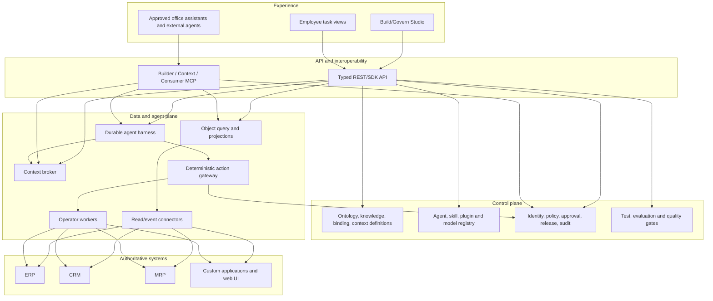
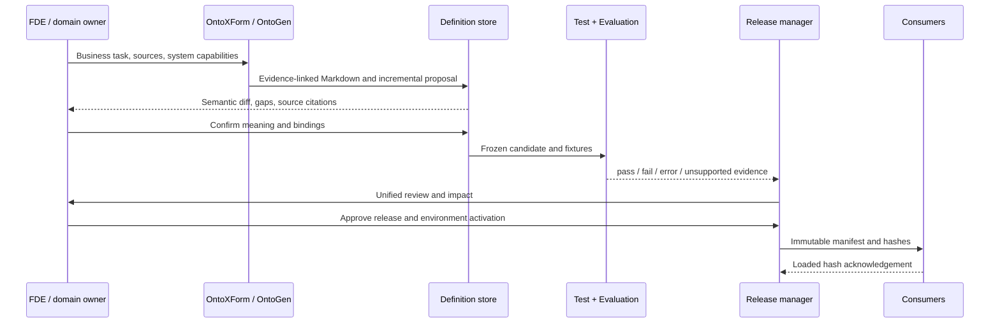

# Platform architecture

## Architectural decision

Build one TypeScript monorepo with **shared versioned contracts** and independently deployable surfaces. The initial production topology is a modular API/control service, a Studio web app, and isolated workers for long-running pipelines, agents, and connectors. A remote MCP gateway can share API code but has a separate identity and network boundary. Package count does not determine service count.

This preserves the lighter delivery model from the [shared design](https://chatgpt.com/share/6ab6a918-827c-83ec-86c5-f022cdc6ea5e) while adding the user-requested native Agent Runtime. It also follows Palantir's current [Ontology/AIP architecture](research/palantir-current.md) in treating semantic data, logic, actions, security, context, and agent execution as one operational system.

## Planes and boundaries



**Control plane** changes definitions, grants, extensions, and releases. **Data plane** serves authorized facts and runs agents. **Action plane** crosses into source systems. A model or client may call an API, but never bypass the action gateway for a business write.

## Ownership of truth

| Asset | Authoritative owner | Stored in Onto Planet |
|---|---|---|
| Business object instance and its transaction state | ERP/CRM/MRP/custom system, or an explicitly declared native object store | Scoped references, selected read models, freshness, provenance |
| Ontology types, rules, actions, functions, policies | Onto Planet approved revision | Canonical versioned definitions |
| Knowledge Markdown | Onto Planet after source-linked human review | Body, metadata, source spans, revisions |
| Raw documents and large evidence | Source repository; authorized copy in object storage if required | Content hash, location, retention and access metadata |
| Bindings to systems | Onto Planet | Versioned mapping and secret reference; never the secret value |
| Agent/Skill/Plugin specification | Onto Planet approved registry | Signed/pinned manifests and reviews |
| Request-time context | No independent authority | Ephemeral Context Pack and trace with source versions/freshness |
| Action outcome | Source system | Attempt, source operation ID, readback evidence, explicit confidence and projection state |
| Search, vector, and graph indexes | Derived from above | Rebuildable projections with source revision and policy-aware filtering |

No external API call is assumed to be part of the same atomic transaction as an ontology edit. A lost response after a possible source write becomes `reconciliation_required` and cannot trigger a blind retry.

## Bounded contexts and source tree

```text
apps/
  studio/               Build, Use, Govern web experience
  api/                  REST and SDK-facing control/query API
  worker/               Durable pipelines, tests, evaluations, agents
  mcp-server/           Remote streamable HTTP endpoint when deployed separately
packages/
  contracts/            Versioned JSON and TypeScript contracts
  ontology-kernel/      Validation, rules, diffs, release canonicalization
  knowledge/            Markdown revisions, sources, dependency index
  pipelines/            OntoXForm and OntoGen job definitions
  object-service/       Query, object sets, functions, timeline, projections
  context-service/      Profiles, retrieval, Inspector and Context Packs
  action-gateway/       Typed intents, policy, preview, approval, receipts
  invocation-boundary/  Authenticated principal and trusted run/action construction
  agent-runtime/        Durable harness, model/context/tool ports, memory
  operator-sdk/         API/event/UI operator contract and conformance
  connector-sdk/        Read, event and action bindings
  mcp-gateway/          Builder, Context and Consumer tool projection
  extension-registry/   Skills, Plugins, grants, signing and rollout
  policy/               Tenant/object/field/action decisions and simulation
  identity/             User, workload, client and delegated source identity
  releases/             Review, quality gate, immutable package, activation
  observability/        Traces, metrics, audit/event schema
skills/                 Reusable versioned procedures
plugins/                Bundled extensions and manifests
evals/                  Task datasets, graders and protected holdouts
examples/               Mock procurement and later ERP/CRM/MRP scenarios
docs/                   Product, architecture, security, ADRs and research
infra/                  Reproducible local and deployment configuration
```

The layout is the target architecture. Only directories with implemented code are created now; the [delivery ledger](05-delivery-plan.md) tracks status. Dependencies point toward `contracts` and deterministic kernel packages. UI, MCP, and model adapters cannot become alternate sources of business policy.

## Shared runtime and deployment model

The first deployable topology uses PostgreSQL for canonical definitions, release manifests, run checkpoints, idempotency records, approvals, and audit; object storage for originals and large evidence; a worker queue backed by durable storage; and optional search/graph projections. A Python knowledge worker may host Semantica or other parsing libraries behind a versioned adapter. Neo4j, a separate vector database, Kafka, Kubernetes, and a service mesh are not prerequisites for the first business flow. They can be added when a measured workload requires them.

A dedicated customer deployment uses **the same signed image** plus isolated tenant config, definitions, credentials, and storage. It does not regenerate source. Shared SaaS tenancy requires tenant-scoped IDs at every boundary, database row security as a second guard, per-tenant secret references, quotas, retention, audit partitions, and explicit cross-tenant denial tests. Runtime identity is the intersection of user delegation, agent workload grant, client grant, tenant policy, and source-system permissions.

## Definition to release flow



The target umbrella release manifest pins ontology, knowledge, bindings, context profiles, policy, agents, skills, plugins, tool catalog, tests/evals, and runtime compatibility. The current ontology kernel implements only an **ontology sub-manifest** that hashes and verifies its ontology bundle; cross-asset release composition belongs to the later Releases package. Neither form contains plaintext credentials. A running agent keeps its starting snapshot unless an explicitly modeled migration resumes it under a new one. `Published`, `Activated`, and `Loaded` are separate states. Rollback changes future configuration; it does not reverse past source transactions.

## Live query and context flow

The Object Service supports three declared read modes: **federated** live read, **materialized** indexed read with source/freshness metadata, and **native** objects explicitly owned by Onto Planet. Query planning uses published read bindings and object/field policy before retrieving data. Response envelopes expose source, observation time, and completeness. Relation traversal, object sets, filters, aggregations, saved queries, registered functions, derived properties, and timelines build on this same service; they do not each create a new data silo.

The Context Service begins with an authorized task, identity, client, and Context Profile. It resolves allowed object references, gathers only required knowledge and current facts, evaluates applicable rules, and returns a bounded pack with citations, timestamps, omissions, conflicts, and permitted capability descriptions. It redacts according to field policy and downstream classification. Tool descriptions or Markdown content never grant execution rights.

## Security and operations

- **Identity:** OIDC for users, short-lived audience-bound workload/source tokens, tenant separation, and delegated source grants. No raw source credentials in prompts, plugins, or release packages.
- **Policy:** object/field/relationship read controls; action and effect-class controls; classification carried into derived output; separation of proposal, approval, and activation duties.
- **Extensions:** signed plugin artifacts, reviewed manifests and schemas, requested capabilities intersected with admin grants, sandboxed execution, staged rollout and revocation. Skill text is untrusted instruction content, not a permission grant.
- **MCP:** authenticate every request; scope tool listing and calling; protect remote fetches against SSRF and token passthrough; map every mutating external tool to a governed ontology action. Client support is capability-negotiated.
- **Runtime:** step, token, time, spend, and side-effect budgets; deadline and cancellation; durable human waits; bounded retries only where safe; explicit unknown result and reconciliation.
- **Observability:** structured run events, OpenTelemetry traces, source operation IDs, object/action attribution, policy decision, cost/latency, and audit with sensitive payload redaction. Audit retention is tenant-policy controlled.

## Delivery and migration

The old `onto-planet` and `agentic-operator-harness` sibling repositories are **reference material**, not copied foundations. Inspect and selectively port confirmed ontology contracts, tests, fixtures, and business knowledge after compatibility review. Do not import private runtime data, tenant-generated applications, old implicit permissions, or a Codex-specific engine as V2's only execution path. The first vertical slice proves one sandbox procurement read/action, role-specific context, a bounded agent run, policy/approval, verification, and release evidence. See [delivery plan](05-delivery-plan.md).
