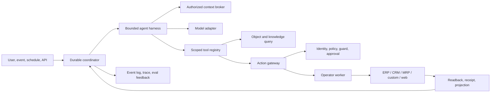

# Agent Runtime, Harness, Operator, Skills, plugins, and MCP

## The new runtime is part of Ontology V2

The Agent Runtime is an Onto Planet product capability, not an optional external consumer. Its native language is Ontology V2: business objects, relations, facts, rules, actions, policy, and source evidence. The runtime is model-agnostic and can also host external agent frameworks behind a conformance port. An external agent may consume scoped MCP tools, but it passes through the same action gateway as a native agent.



## Runtime contracts

**AgentSpec** defines triggers, task goals, allowed context profiles, allowed read/action capabilities, model routing, memory policy, output schema, evaluation suite, effect ceiling, and budgets. **RunSnapshot** pins the ontology release, knowledge revisions, bindings, context profile, agent spec, model, policy, skill/plugin versions, MCP tool digests, and fixture/environment. A run cannot silently adopt new policy or tool definitions halfway through execution.

**ContextItem** carries content or an object reference plus tenant, source, observation time, classification, provenance, and validity. **RunEvent** records typed transitions (trigger, context retrieval, model request/response metadata, tool proposal/result, policy decision, approval wait, operator attempt, verification, cancellation, failure). **Effect** is a proposed query or ActionIntent; it does not execute by existing in model output.

**ActionIntent** is the only native business-write request from an agent:

```text
action ID + schema version
tenant, domain, run and invoking principal
target object IDs and expected source revisions
typed arguments and business purpose
target binding/environment and deadline
canonical intent hash
```

The runtime injects principal, tenant, run ID, and idempotency key from authenticated context; model text cannot set them. The hash covers the exact action version, targets/revisions, arguments, actor, target system, and deadline. Approval is bound to that hash and expires; any changed argument, source revision, replan, or target invalidates it. The action gateway checks the live source preconditions again immediately before execution.

The `invocation-boundary` package authenticates through an injected identity port, resolves reviewed agent/tool pins, filters tools by grants, constructs the run identity, and derives action targets from an active binding. It rejects caller-supplied authority fields. The runnable v0.2 API uses local sessions or scoped tokens, with an optional OIDC adapter, and injects PostgreSQL checkpoints/intents into the platform runtime. Leased workers re-read the actor's current grants and intersect them with the original invocation's scope ceiling; background execution cannot expand a token's rights. In-memory adapters remain for unit fixtures. Real IdP acceptance, source delegation and workload identity are deployment gates.

**ActionReceipt** records decision, policy version, approver if any, source operation ID, response and readback evidence, outcome, trace ID, and compensation/reconciliation status. The system distinguishes `executed` (source call accepted), `source_confirmed` (readback verified), and `ontology_projected` (read model updated). An externally completed action cannot be reported as a completed business outcome merely because the HTTP request returned 200.

## Harness behavior

The harness executes a bounded plan/observe/replan loop. It discovers tools allowed by the pinned AgentSpec, original invocation scope ceiling and current principal; the action gateway additionally checks deterministic policy, active source binding and live source revision. It requests authorized Context Packs, gives the model bounded context, parses typed outputs and validates proposed effects. In v0.2, action lifecycle records are persisted independently, while harness checkpoints are saved at approval/unknown suspension boundaries. A process interruption before a resumable checkpoint moves the run to manual recovery without replaying a potentially completed write. Checkpointing every intermediate model step remains a later reliability improvement. The model port can change without changing action semantics.

Each run enforces step, time, token, spend, tool-call, memory, and side-effect budgets. Cancellation and deadlines are durable. Replays are used for diagnosis and evaluation, never to reissue a potentially completed external write. Multiagent delegation creates child runs with a narrower capability set and separate budgets/traces; a child never inherits an unrestricted parent token.

Memory is optional, tenant-scoped, provenance-tagged, retention-controlled, and not a source of policy. Confirmed decisions and source receipts can be recalled as context; model-generated speculation cannot become an approved fact by being stored. Retrieved documents, web pages, skill text, and third-party MCP descriptions are untrusted content.

## Action gateway and effect tiers

| Effect tier | Examples | Default handling |
|---|---|---|
| Read | Query an authorized order | Policy-filtered result, source/freshness metadata |
| Reversible write | Update a draft note | Preview, policy, receipt, source verification |
| Material business write | Approve a purchase request, reschedule production | Exact-intent approval or approved automation policy, separation of duties, readback |
| Irreversible/regulated/physical | Payment, release to production line, high-impact decision | Stronger human/process approval, specialized source controls, explicit go-live gate |

The gateway follows this sequence:

```text
1. Parse and validate typed intent against the pinned action definition.
2. Resolve target and current source revision; reject cross-tenant and stale references.
3. Intersect user delegation, agent grant, client grant, tenant policy, and source ACL.
4. Evaluate deterministic business guards; unknown/error fails closed.
5. Ask the operator for a non-mutating preview/diff and risk classification.
6. Obtain exact-intent approval when policy requires it.
7. Recheck actor, expiry, revision, guard and binding at execution time.
8. Record attempt and idempotency key; obtain short-lived source-specific credential.
9. Execute once under connector timeout and rate limits.
10. Read back/verify in the source; reconcile projection; append immutable receipt.
```

An operator may report `confirmed`, `rejected`, `failed_before_effect`, or `outcome_unknown`. The latter enters `reconciliation_required`; an automatic retry is forbidden until a source lookup proves no effect occurred. Cross-system operations use an orchestrated saga with explicit compensation where business semantics permit it. A compensation is a new auditable business operation, not an erased history. These limits align with Palantir's documented [external action consistency](https://www.palantir.com/docs/foundry/action-types/consistency-guarantees) and [webhook behavior](https://www.palantir.com/docs/foundry/action-types/webhooks).

## Operator ports

Each operator adapter implements `describeCapabilities`, `observe`, `preview`, `execute`, `verify`, and, where meaningful, `compensate` or `reconcile`. It declares support for idempotency keys, source revision checks, readback, rate limits, sandbox environment, and effect tier. Conformance tests exercise lost responses, duplicate requests, stale revisions, denial, partial success, and compensation.

Preferred order is source **API**, then governed **event/function**, then isolated **UI operator** for systems with no suitable API. The UI operator runs in a tenant-isolated browser session with target origin allowlist, constrained credentials, bounded steps, DOM/screenshot evidence, and human escalation for CAPTCHA, ambiguous screens, or unknown commit status. A UI click is not made idempotent by wishing it so; after uncertainty it reconciles or asks a human. API and UI implementations expose the same business ActionDefinition.

## Identity and policy

User login uses the enterprise IdP. Runtime workloads have their own short-lived identity. Remote MCP and source calls use audience-bound delegated tokens or narrowly scoped service credentials; no token passthrough into unrelated tools. A tool is visible only if both publication and current authorization allow it, and authorization is repeated at invocation. Object/field filters apply before model context construction; derived outputs carry classification and disclosure restrictions. Agents cannot create grants, approve their own release, or lower a required quality gate.

## Reusable Skills

A Skill is a **versioned, testable task procedure**: trigger/description, required context and capabilities, instructions, examples, expected output, known failure cases, and provenance. Examples include “investigate a late order,” “map a procurement policy to ontology,” and “verify an ERP approval receipt.” Skills may be authored by FDEs or bundled in Solution Packs. They are loaded on demand, not all placed in every prompt. Their requested capabilities must be granted separately by policy; installing or reading a Skill never grants a tool.

A Skill release is bound to an ontology and tool-contract compatibility range. The registry validates references, test fixtures, license/provenance, and allowed data classification. A change to a Skill is reviewed and evaluated against protected cases before activation. Where host support exists, [MCP Skills](https://modelcontextprotocol.io/extensions/skills/overview) can expose metadata and content; host capability negotiation and a standard resource fallback are required.

## Plugins and Solution Packs

A Plugin is a signed, versioned bundle that can include skills, MCP servers, connector adapters, ontology templates, UI cards, policy requirements, tests, and an SBOM. Its manifest states publisher, artifact hash, compatible platform/ontology versions, requested capabilities, network destinations, data classifications, deployment isolation, and revocation behavior. Installation checks publisher/signature, schemas, supply-chain policy, sandbox conformance, and an administrator's exact grants. Rollout is staged and reversible; a plugin upgrade cannot silently expand grants.

A Solution Pack is a domain-facing composition of ontology templates, knowledge templates, bindings contracts, tests/evals, Context Profiles, task skills, and business cards. It helps an FDE start from a task, but sample approval amounts, roles, and policies are never auto-adopted as customer truth.

## MCP access hub

The current [MCP specification is dated 2026-07-28](https://modelcontextprotocol.io/specification/2026-07-28). Build against its stateless, request-scoped authorization and capability discovery, with optional [Tasks](https://modelcontextprotocol.io/extensions/tasks/overview) and [Skills](https://modelcontextprotocol.io/extensions/skills/overview) negotiated per client. MCP is the interoperability layer, not the source of business authorization.

| Surface | Audience | Example tools | Authority |
|---|---|---|---|
| **Builder MCP** | FDE, implementation/coding agent | Inspect schema and lineage, propose draft, run test/eval, request review | Draft/edit only within builder grants; cannot self-approve or activate |
| **Context MCP** | Employee and read-oriented office client | Search approved knowledge, get task context, query permitted objects, explain rule | Authorized read only |
| **Consumer MCP** | Business application or agent | Query object set, call registered function, preview/submit governed action, poll task/receipt | Published app scope plus principal and action policy |

All three can run in one gateway codebase with distinct registered endpoints and grants. Tool listing is filtered per request; consumer tools never include arbitrary SQL, shell, unrestricted HTTP, or a raw source credential. Mutating third-party MCP tools are imported only after origin/schema digest review and mapped to an ontology ActionDefinition. The compatibility lab records host/version, transport, auth, list/call, structured response, UI, async tasks, revocation, and real workflow behavior. An interactive MCP App is an enhancement, with a structured-content/text fallback.

## Agentic applications and external agents

An agentic application is a versioned composition of a business task, Context Profile, AgentSpec, Skills, published query/action capabilities, presentation cards, and evaluation suite. The application owns a user journey and permissions, not a copy of the platform backend. External agent federation may later use the current [A2A protocol](https://a2a-protocol.org/v1.0.0/specification) for task handoff. A2A delegation does not bypass Onto Planet identity, policy, or ActionIntent checks.

## Test and evaluation obligations

The Test Harness proves deterministic contracts: schema/reference validity, rule edges, field mapping, row/field policy, action guards, duplicate intent handling, idempotency, source timeout, readback, and tenant isolation. Tests run with frozen fixtures or a separate sandbox identity that has no production write credential.

Evaluations measure task success, factual grounding, authorization correctness, citation, freshness, tool selection, latency, token/cost, and resilience across LLMs, agents, workflows, Context Profiles, pipelines, and office clients. Protected holdout cases and human-approved reference answers prevent the same model from authoring both the solution and its grading key. Safety failures are hard gates, never averaged away by a quality score. A bounded improvement loop proposes changes, tests in isolation, compares to the baseline, and requests human review; it cannot alter the gate or erase failures.
